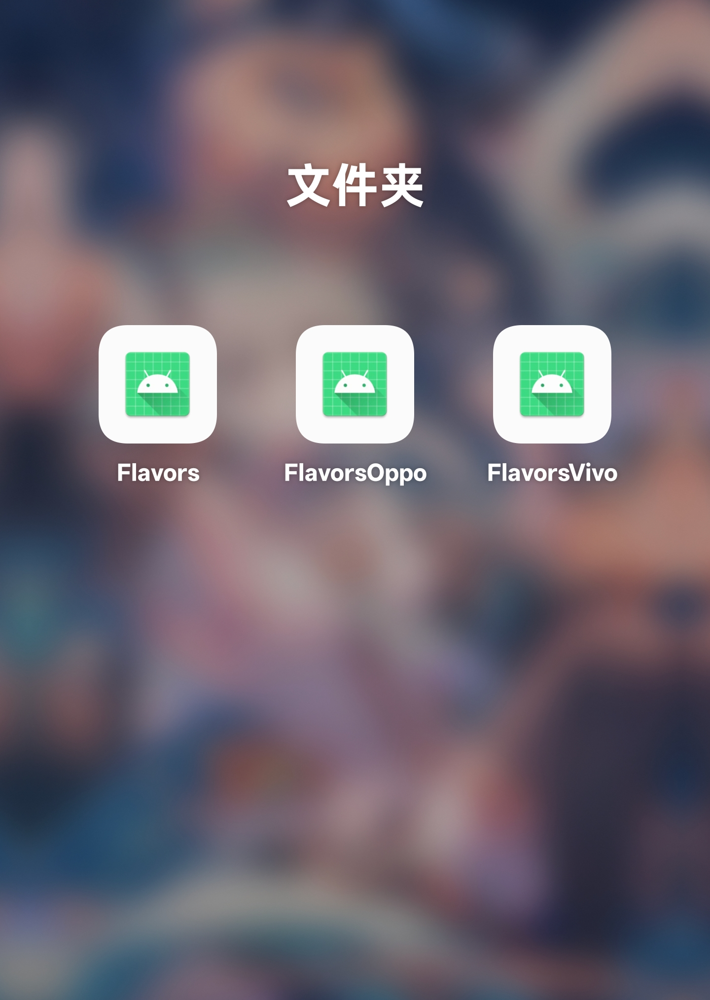
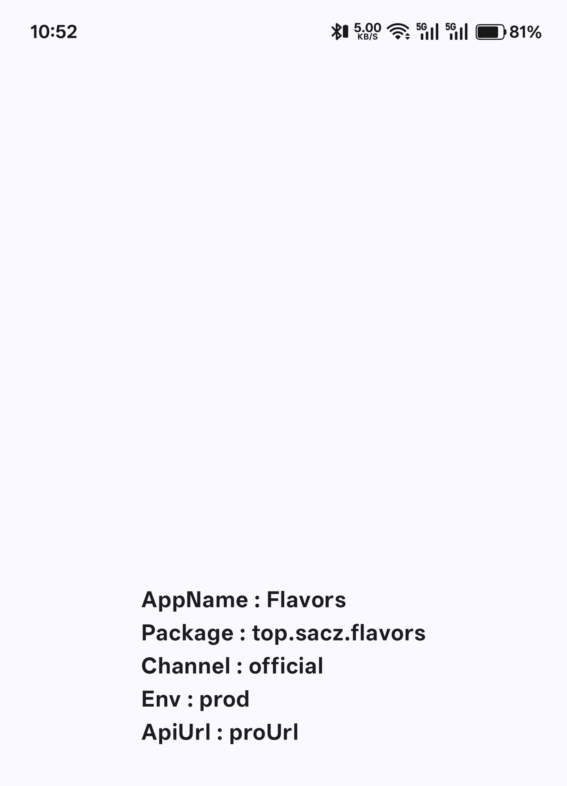
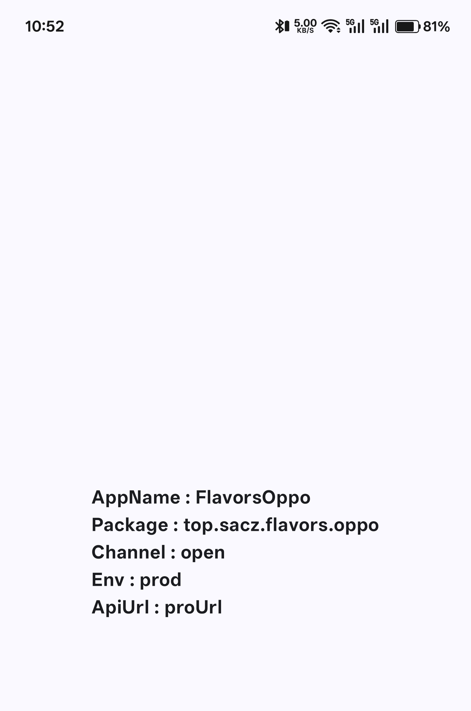
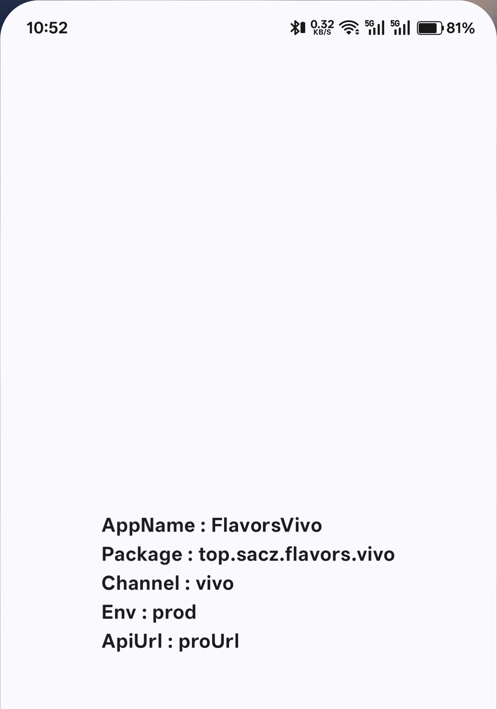
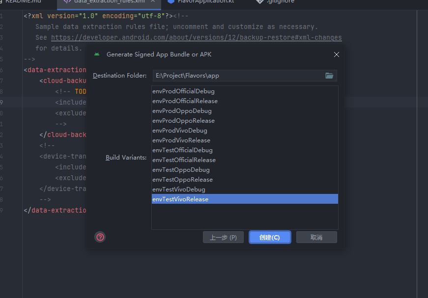
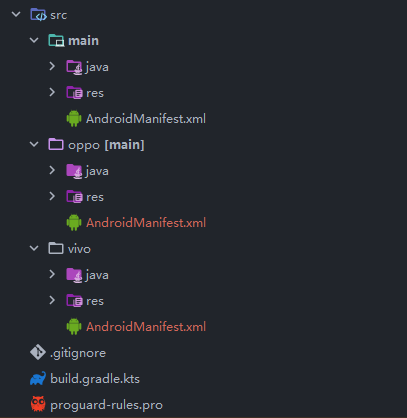

### Android多渠道分包示例
在桌面上的效果

在app内的效果





### 实战步骤
在app目录的build.gradle.kts文件中添加如下代码：
 ```gradle
    // 创建产品风味维度(渠道类型) 我这里设置为 环境和渠道
    flavorDimensions ("env", "channel")

    // 创建产品风味(渠道)
    productFlavors {
        // 环境
        create("envProd") {
            //维度归类
            dimension = "env"
            //添加环境标识到BuildConfig类中
            buildConfigField("String", "ENV", "\"prod\"")
        }
        create("envTest") {
            dimension = "env"
            //添加环境标识到BuildConfig类中
            buildConfigField("String", "ENV", "\"test\"")
        }

        // 渠道
        create("official") {
            dimension = "channel"
            applicationId = "top.sacz.flavors"
            //设置AndroidManifest的属性
            manifestPlaceholders.putAll(mapOf("CHANNEL_VALUE" to "official"))
        }
        create("vivo") {
            dimension = "channel"
            applicationId = "top.sacz.flavors.vivo"
            manifestPlaceholders.putAll(mapOf("CHANNEL_VALUE" to "vivo"))
        }
        create("oppo") {
            dimension = "channel"
            applicationId = "top.sacz.flavors.oppo"
            manifestPlaceholders.putAll(mapOf("CHANNEL_VALUE" to "open"))
        }
    }
```

然后在构建的选项中就会有新的构建选项



如果想要为渠道区分不同的资源,在main同级目录创建对应flavor名称的目录即可,然后按照固有结构写资源
